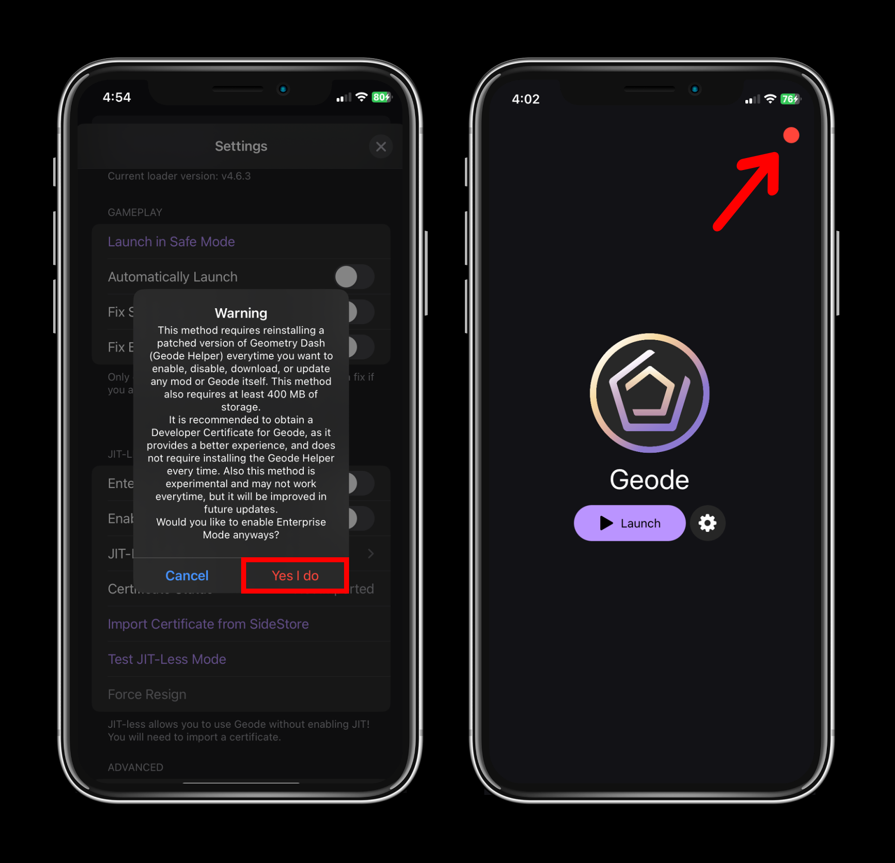
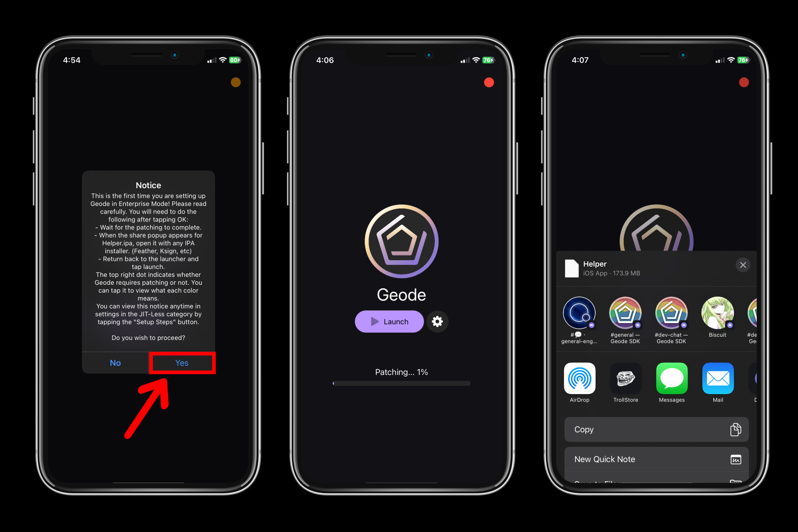
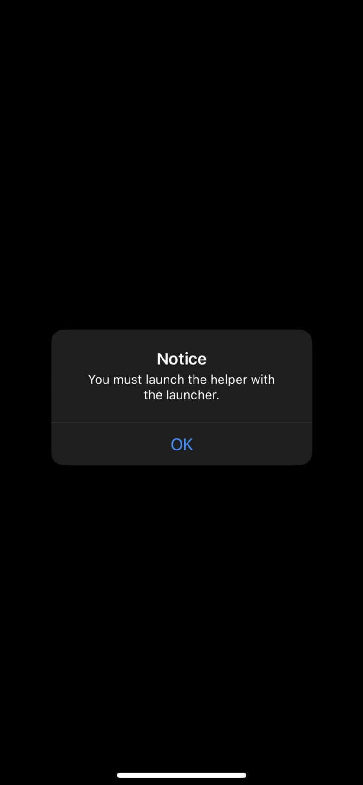

# Installation Guide (Enterprise Certificates)
> [!IMPORTANT]
> While this guide will teach you how to enable and use certificates without entitlements on Geode, it is still recommended to buy a Developer Certificate if you can, and follow the [JIT-Less guide](./JITLESS-INSTALL-GUIDE.md), as this method is not endorsed or recommended.
> This is because this method is time consuming, tedious, and slow for using Geode, as it will require you to install a patched Geometry Dash ("Geode Helper") each time you want to install a mod, update a mod, enable a mod, disable a mod, update geode, and launch in safe mode.

> [!CAUTION]
> This guide will not teach you how to go about obtaining such certificates. These certificates ("free certificates") violate [Apple's Terms of Service](https://developer.apple.com/support/terms/apple-developer-program-license-agreement/#ADPLA5), and may get your iDevice blacklisted. As such, this guide is only for educational purposes, given the consequences: Use at your own risk.
> If you are fine with this, and acknowledge the warning, you can proceed to follow this guide.

This tutorial is for people who cannot afford to purchase a Developer Certificate, and do not have a computer, but wish to use Geode.

## Prerequisites
- **Full version of Geometry Dash installed**
- An internet connection
- A signer/installer of your choice with a certificate ([Feather](https://github.com/khcrysalis/Feather) as an example)
- **IPA file** of Geode launcher from [Releases](https://github.com/geode-sdk/ios-launcher/releases/latest)
- At least 400 MB of storage available

> [!WARNING]
> Currently, this method only works if you have Geode on nightly release. To enable this in the launcher, open settings, enable **Use Nightly Release**, and tap **Check for Updates**

## Setting up Enterprise Mode
After setting up Geode, verifying you own Geometry Dash, and downloaded the libraries, you will need to enable **Enterprise Mode** in settings.

After enabling, you will notice a dot on the top right after exiting settings. This is the patch indicator, which tells you whether or not the Geode Helper (patched Geometry Dash) requires patching.

### What each indicator means:
- **Green** - No patching required, can launch the Helper immediately.
- **Yellow** - A patch is required. (Mod enabled, disabled, downloaded, etc)
- **Orange** - IPA is currently being compressed, or you exited the app before it finished patching.
- **Red** - A patch was forced and required. (A Geode update, forced by User, etc)

After confirming the dot is on the top right, tap launch. It will show a popup giving you instructions on what to do. These instructions can be viewed anytime in settings.

When the patching is complete, an **IPA file** named "Helper.ipa" will be shown in the share view. You will open the **IPA file** with the signer/installer of your choice, such as **Feather** for example. The installation process may take a while, as it is installing a patched Geometry Dash.

## Post Setup Steps
After installing the Helper, you **must** open it with the launcher. Otherwise an error like this will show up:

This is because it is a **requirement** to use the launcher to open the Helper. Otherwise it won't be able to properly know if you want to launch in safe mode, and assume you are running it with JIT, which is not what you have.

Once you launch the **Helper** with Geode by opening Geode and tapping launch, you will notice that it's asking to open the app in Geode. You will tap Open, and it should bring you back to the launcher, then back to the helper.

After that, you should be in the game!

> [!NOTE]
> Anytime you want to install the Helper IPA, assume you are updating it. Uninstalling the Helper will cause your save data to be deleted.

> [!TIP]
> If the launcher thinks you need to patch, but you do not want to, simply: Exit the Geode app, reopen the Geode app, go to settings, tap **Launch without patching**
> Only do this if you believe you have not installed a mod, updated a mod, enabled a mod, or disabled a mod, otherwise you will have issues.
