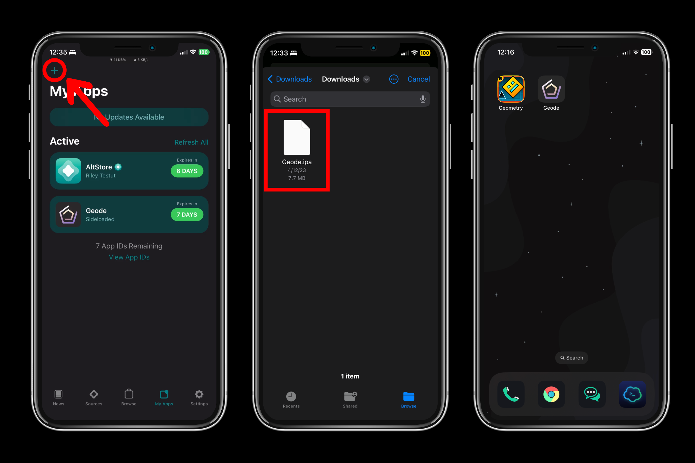
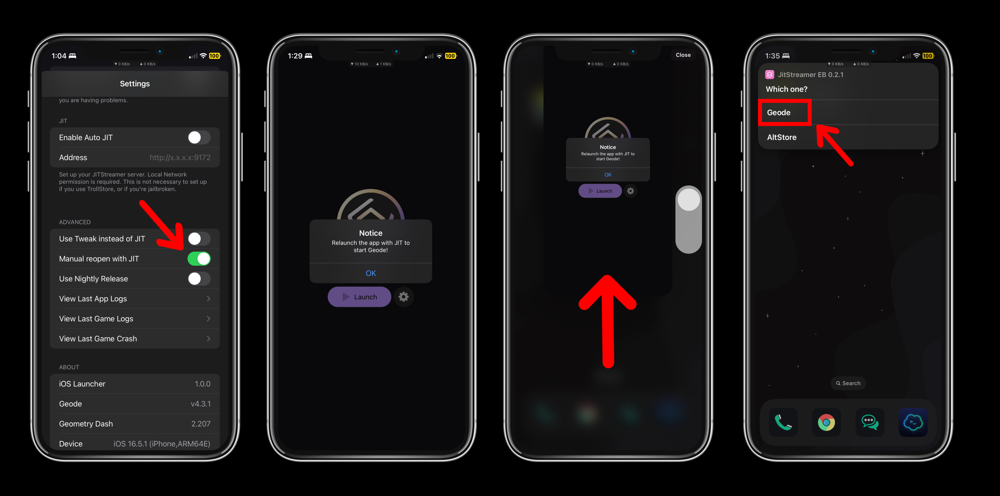

# Installation Guide
> ⚠️ **Warning**: For this installation guide, it is **recommended** to have a computer with Administrator access, as this guide will require installing software on your computer to sideload Geode. Additionally, **JIT** is a **__requirement__** if you want to run Geode without jailbreaking.

## Prerequisites
- iOS/iPadOS 14.0 or later
- PC (Windows, Linux) or Mac OS
- Apple ID (Secondary / Throwaway Recommended)
- USB Cable to connect your device (Lightning / USB C)
- [AltServer](https://altstore.io/) or [Sideloadly](https://sideloadly.io/) installed on your computer

## Installing AltStore / SideStore
> 💡 **Tip**: You can skip this step if you are using Sideloadly or TrollStore, but you may still need to follow the first few steps, especially if you have never sideloaded an app before.

1. **Enabling Developer Mode (iOS 16+)**
	- If you are on iOS 16 or later, you will need to enable **Developer Mode** in order to launch third party apps like AltStore, otherwise you will encounter this error when attempting to sideload AltStore or any app:
	- 
	- To enable **Developer Mode** on your iOS device, navigate to `Settings -> Privacy & Security -> Developer Mode`. Do note that this will require restarting your device.
	- 
	- After your device restarts, you will be prompted to "Turn on Developer Mode", press "Turn On", and **Developer Mode** should be enabled!

2. **Installing AltServer on your computer**
	- Download and install [AltServer](https://altstore.io/), or [AltServer-Linux](https://github.com/NyaMisty/AltServer-Linux) for Linux.

3. **Installing AltStore**
	- If you plan on installing SideStore, skip this step, otherwise follow these steps depending on what computer you have:
	- [Windows Guide](https://faq.altstore.io/altstore-classic/how-to-install-altstore-windows)
	- [Mac OS Guide](https://faq.altstore.io/altstore-classic/how-to-install-altstore-macos)

4. **Installing SideStore** (Recommended)
	- If you plan on installing AltStore, skip this step, otherwise follow the steps provided on the website: https://sidestore.io/#get-started
	- SideStore is recommended if you do not want to refresh your apps while keeping your PC on.

Now you can proceed with installing Geode! If you are not jailbroken, **install the IPA**, otherwise install the **TIPA** file if you are jailbroken and have TrollStore.

## Installing Geode through AltStore / SideStore
> ℹ️ **Note**: You will need to **refresh** both the store and Geode every week, otherwise you will not be able to run the app.

Navigate to the **My Apps** tab, and tap the `+` button to add an app. Select the IPA for the Geode app, and the Geode app should appear on your home screen!

## Installing Geode through TrollStore
Tap the `+` button and tap either **Install IPA File** or **Install From URL**, depending if you manually downloaded the TIPA file. After either selecting the TIPA file for the Geode app, or providing the URL, the Geode app should appear on your home screen!

## Post Installation (IPA / Non-Jailbroken)
> 💡 **Tip**: You can skip this step if you installed the .tipa version of Geode, and are jailbroken. Simply follow the steps in the setup process in the app.

After going through the setup process, you may have seen the warning that **Just-In-Time** (JIT) compilation is required. This is true if you want to run Geode without being jailbroken, as by default, Apple restricts how apps can manage memory.

> ⚠️ **Warning**: JIT also requires you to have **Wi-Fi** enabled on your iOS device. Cellular and/or Airplane Mode will **not work**.

There are a few ways to launch Geode with JIT, depending on both iOS version, and your use case.

### For iOS 16.6.1 and Below
> ℹ️ **Note**: This method requires **AltStore** or **SideStore**. If you sideloaded this app with Sideloadly, this method __will not work__.

Ensure that AltServer is running before proceeding. Also if you are on iOS 16.6.1 or Below, it is recommended to install **TrollStore** instead here: https://ios.cfw.guide/installing-trollstore

#### Option 1: AltStore  (AltJIT)
1. Enable the **Manual reopen with JIT** setting in the Geode app if you are using AltStore.
2. Tap the **Launch** button in the Geode app.
3. Exit the Geode app.
4. Open AltStore.
5. Navigate to the **My Apps** tab.
6. Long-press the **Geode** app, 
7. Press "Enable JIT"
8. Geode should launch in Geometry Dash!

#### Option 2: SideStore
1. Tap the **Launch** button in the Geode app.
2. Geode should launch in Geometry Dash!

### For iOS 17+
#### JITStreamer
> ℹ️ **Note**: For the first time setup, you will need a computer to get a Pairing File. After the setup, you will never need a computer for SideStore or JIT. If you installed SideStore, you likely already have a pairing profile, meaning there is no need to reinstall JitterBugPair.

[JITStreamer](https://github.com/jkcoxson/JitStreamer-EB) works for iOS 18+, and overall is the recommended method to launching Geode with JIT, as it does not require a computer each time you want to run Geometry Dash.

#### Option 1: Auto JIT
1. Follow https://jkcoxson.com/jitstreamer (For JitterBugPair, install the `.zip` corresponding to your operating system.)
2. It is recommended to follow the guide on an iOS device, as you will need to upload the pairing file to get the wireguard config.
3. After installing the shortcut, launch the **Geode** app again.
4. Enable the **Enable Auto JIT** setting in the Geode app.
5. Set the **Address** to be `http://[fd00::]:9172` if it isn't already set to that.
6. Enable the `jitstreamer` VPN in the WireGuard app
7. Tap the **Launch** button in the Geode app.
8. Geode should launch in Geometry Dash!

#### Option 2: Manual Method
1. Enable the **Manual reopen with JIT** setting in the Geode app.
2. Follow https://jkcoxson.com/jitstreamer (For JitterBugPair, install the `.zip` corresponding to your operating system.)
3. It is recommended to follow the guide on an iOS device, as you will need to upload the pairing file to get the wireguard config.
4. After installing the shortcut, launch the **Geode** app again.
5. Tap the **Launch** button in the Geode app.
6. Exit the Geode app.
7. Open the **JitStreamer EB** Shortcut
8. Tap **Geode** when the shortcut asks "Which one?"
9. Geode should launch in Geometry Dash!

> Optionally, you can follow the youtube tutorial here for installing both SideStore and JITStreamer: https://www.youtube.com/watch?v=Mt4cwFyPsoM

## Post Installation
You should now be able to run Geometry Dash with Geode! You can install mods by tapping the **Geode** button on the bottom of the menu, and browse for mods to install!
