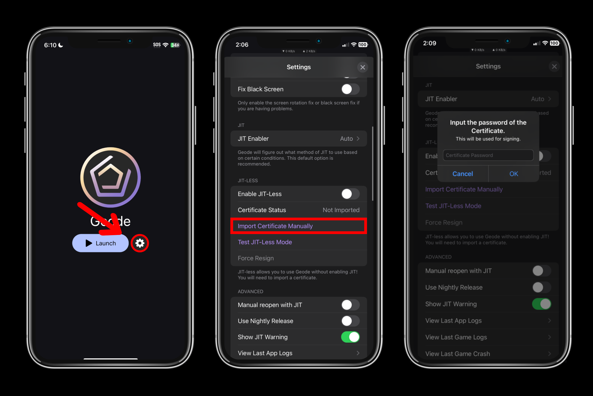
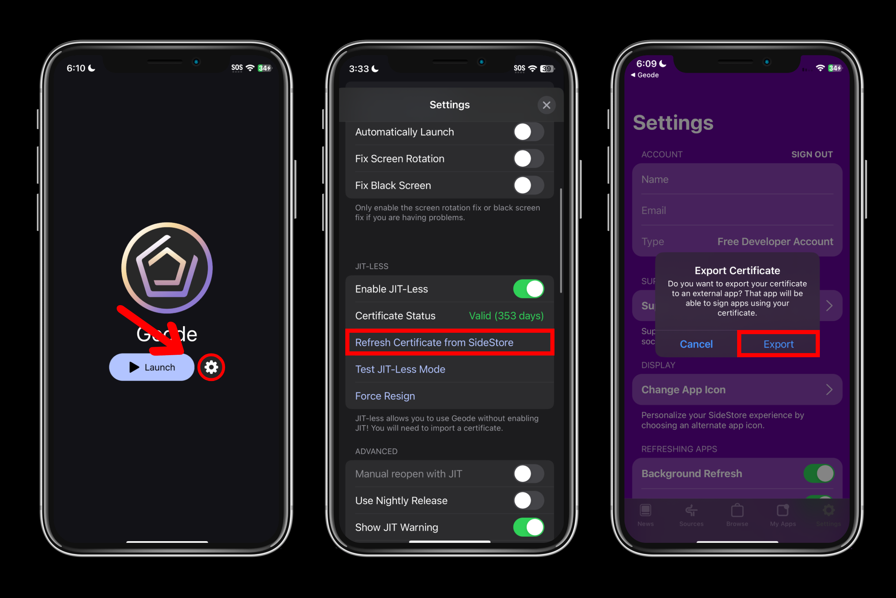

# Installation Guide (JIT-Less)
> [!WARNING]
> Enterprise Certificates, and certificates without the entitlement `get-task-allow` currently do not work. A developer certficate (or one from SideStore) is required for you to follow this guide. In the future, this notice will be removed after support is implemented.

This tutorial is mainly for iOS 26, as Apple broke enabling JIT on iOS 26, but it should theoretically work for any iOS version. This guide is also for those that wish to use Geode, but don't have a computer.

# Prerequisites
## SideStore Method
> [!WARNING]
> Only SideStore is supported for JIT-less as it is the only sideloader that exposes the certificate. AltStore and Sideloadly will not work.

> [!TIP]
> If you have never installed SideStore before, follow the first prerequisites, then follow the [iOS 17.4+ (SideStore)](./MODERN-IOS-INSTALL.md) guide until the **Post Installation** section, then come back to this guide.

- **PC** (Windows, Mac, Linux)
- **USB Cable** to connect your device (Lightning / USB C)
- **Apple ID** (Secondary / Throwaway Recommended)
- **Full version of Geometry Dash installed**
- **An internet connection**
- **SideStore** (if you have SideStore 0.6.0 or above, install the nightly version of SideStore by going to the app settings and enabling the beta updates. If you are on a version below 0.6.0, get [this version](https://github.com/geode-sdk/ios-launcher/raw/refs/heads/main/screenshots/SideStore-0.6.2-pr.959+4534534.ipa))
- **IPA file** of Geode launcher from [Releases](https://github.com/geode-sdk/ios-launcher/releases)

## Apple Developer Certificate Method
> [!WARNING]
> Only use this method **if you're willing to pay** for an Apple developer certificate.
> \
> When you get an Apple developer certificate, **make sure to ask your provider to give your certificate the `get-task-allow` entitlement.** (Usually called "Developer" certificate)

- **Full version of Geometry Dash installed**
- **An internet connection**
- An **Apple developer certificate** (you can get one from services like [KravaSign](https://kravasign.com) or [Signulous](https://www.signulous.com))
- **IPA file** of Geode launcher from [Releases](https://github.com/geode-sdk/ios-launcher/releases)

# Enable JIT-Less
A new section has been added to the Geode launcher's settings for JIT-less. Here's how to use it:

## Import Apple Developer Certificate
> [!TIP]
> To get the certificate file (**.p12**) of your Signulous certificate, follow [this guide](/SIGNULOUS-CERTIFICATE-FILE-GUIDE.md)

- Press **"Enable JIT-Less"**
- Press **"Import Certificate Manually"**
- Choose the **.p12** file of the certificate you used to sign the Geode launcher
- Input the password of your certificate **(make sure to input the password correctly, or Geode will fail to do the signing process)**
- Press **"Test JIT-Less Mode"** to test if JIT-less mode works properly 

## Import SideStore Certificate
> [!WARNING]
> Before this step, **make sure to get the correct version of SideStore.** Not doing so will cause the button to do absolutely nothing. (The correct version is mentioned in the Prerequisites section)
> This notice will be removed once SideStore updates to support exporting certificates.

- Press **"Enable JIT-Less"**
- Press **"Import SideStore Certificate"**
- Press **"Test JIT-Less Mode"** to test if JIT-less mode works properly

# Post Install
Simply verify Geometry Dash, download Geode, then launch the game with Geode.
