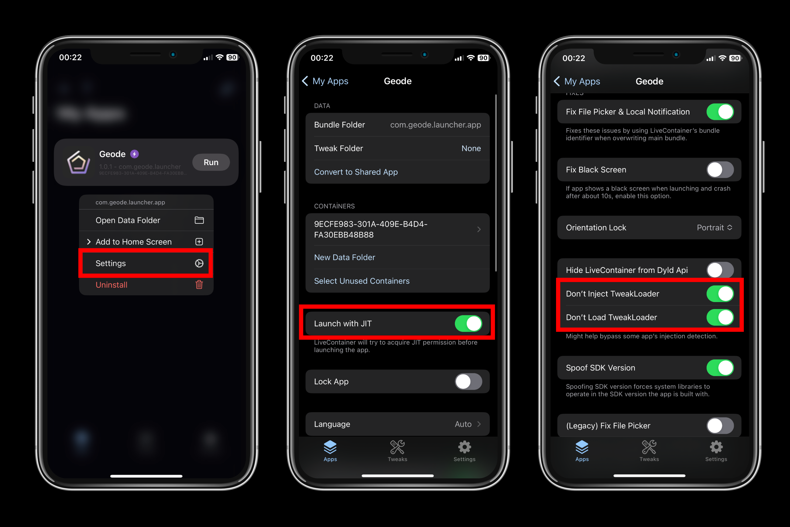
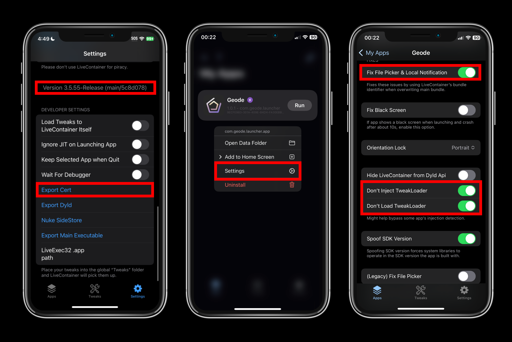

# Installation Guide (LiveContainer)
This tutorial is for people that use LiveContainer to bypass Apple's 3 active app and 10 app ID limit.

> [!TIP]
> If you have never installed SideStore before, follow the [iOS 17.4+ (SideStore)](./MODERN-IOS-INSTALL.md) guide, excluding the **Geode** sideloading, then come back to this guide.

# JIT Only
## Prerequisites
- LiveContainer
- A **JIT enabler** (e.g. StikDebug)
- An internet connection
- IPA file of Geode launcher from [Releases](https://github.com/geode-sdk/ios-launcher/releases)

## Set Up LiveContainer for Geode
- Sideload Geode using LiveContainer
- Hold on the app and go to the Geode app settings in LiveContainer, then **enable these settings:**

- **Launch with JIT**
- **Don't Inject TweakLoader**
- **Don't Load TweakLoader**

After these steps:

- Open Geode
- Press **"Verify Geometry Dash"**
- Press **"Download"**
- Press **"Launch"**
- Close LiveContainer from the app switcher when prompted to reopen the launcher
- Open Geode **with JIT** in LiveContainer

# JIT-Less
## Prerequisites
- LiveContainer (Latest)
- Confirming JIT-less works on LiveContainer
- An internet connection
- IPA file of Geode launcher from [Releases](https://github.com/geode-sdk/ios-launcher/releases)

## Set Up LiveContainer for Geode
- Sideload Geode using LiveContainer
- Hold on the app and go to the Geode app settings in LiveContainer, then **enable these settings:**

- **Fix File Picker & Local Notification**
- **Don't Inject TweakLoader**
- **Don't Load TweakLoader**

After these steps:
- Tap on **"Settings"** on the bottom right
- Scroll down until you see the version of LiveContainer
- Tap on the version text 5 times.
- Scroll down and tap **"Export Cert"** then return to **"Apps"** in the bottom left.

Finally, the last steps are:

- Open Geode
- Press **"Verify Geometry Dash"**
- Press **"Download"**
- Open Settings
- Scroll down until you reach **"Copy Mobile Provision"**
- Press **"Test JIT-Less Mode"** to test if JIT-less mode works properly
- Exit settings & press **"Launch"**
