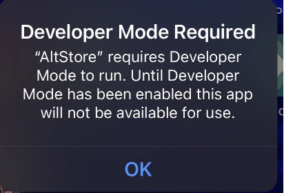
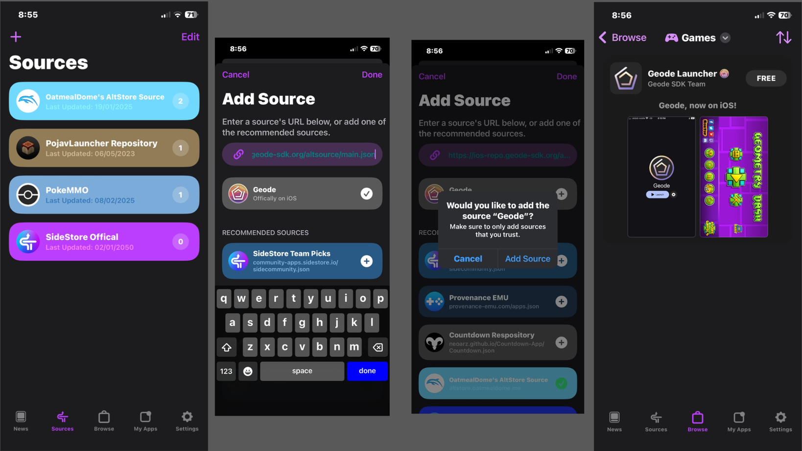
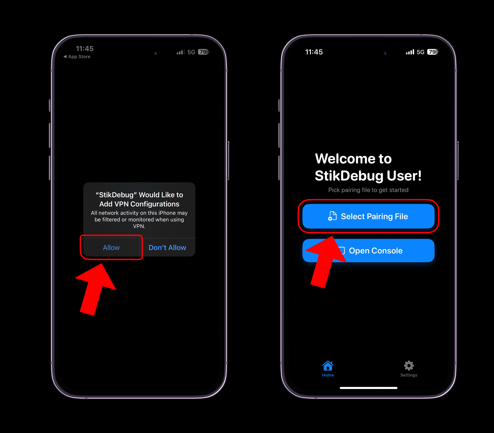

# Installation Guide (SideStore)

> [!WARNING]
> For this installation guide, it is **required** to have a computer with Administrator access, as this guide will require installing software on your computer to sideload Geode, and to obtain a pairing file for **JIT**. Additionally, **JIT** is a **__requirement__** to run Geode.
> \
> This guide assumes you will be installing SideStore. Using enterprise certificates to install SideStore **will not work**, as the usage of a PC is required to sideload SideStore.

## Prerequisites
- PC (Windows, Mac, Linux)
- Apple ID (Secondary / Throwaway Recommended)
- USB Cable to connect your device (Lightning / USB C)
- Full version of Geometry Dash installed
- An internet connection
- A passcode on your device (required for pairing file)
- IPA file of Geode launcher from [Releases](https://github.com/geode-sdk/ios-launcher/releases/latest) (If you don't want to use this, follow the **AltSource** method below)

## Install SideStore

1. **Installing SideStore**
	- Follow the steps provided here: https://sidestore.io/#get-started

2. **Enabling Developer Mode**
	- You will need to enable **Developer Mode** in order to launch third party apps like SideStore, otherwise you will encounter this error when attempting to launch SideStore or any sideloaded app:
	- 
	- To enable **Developer Mode** on your iOS device, navigate to `Settings -> Privacy & Security -> Developer Mode`. Do note that this will require restarting your device.
	- 
	- After your device restarts, you will be prompted to "Turn on Developer Mode", press "Turn On", and **Developer Mode** should be enabled!
    - If **Developer Mode** doesn't show up, sideload SideStore!

## Installing Geode through SideStore
> [!NOTE]
> You will need to **refresh** both the store and Geode every week, otherwise you will not be able to run the app.

Here you have 2 options:

1: Navigate to the **My Apps** tab, and tap the `+` button to add an app. Select the IPA for the Geode app, and the Geode app should appear on your home screen!

2: Navigate to the **Sources** tab, and tap the `+` button to add the Geode AltSource. In the input box, type `https://ios-repo.geode-sdk.org/altsource/main.json`, then press the `+` button. Now go to the **Browse** tab, then **Games**, and you will find Geode. Press `Free` to install it.

> [!NOTE]
> The AltSource method may recieve updates *later*, and should only be used if you are okay with this.

## Post Installation
After going through the setup process, you may have seen the warning that **Just-In-Time** (JIT) compilation is required. This is true if you want to run Geode since Apple restricts how apps can manage memory.

> [!WARNING]
> JIT also requires you to have **Wi-Fi** connection or **Airplane Mode** enabled on your iOS device. Cellular will **not work**.

## Installing and Using StikDebug to Enable JIT
> [!NOTE]
> For the first time setup, you will need a computer to get a pairing file. If you installed SideStore, you likely already have a pairing file, meaning there is no need to reinstall iDevice Pair.

#### Steps for downloading iDevice Pair (Skippable if you already have a Pairing File)
1. Go to [iDevice Pair](https://github.com/jkcoxson/idevice_pair/releases) and download the version for your computer.
2. Run the program with your iOS device connected to your computer. It will save a file to your computer.
3. Use iCloud, AirDrop, [LocalSend](https://localsend.org), or a website such as [Pairdrop](https://pairdrop.net/) to upload the pairing file to your iOS device.

#### Downloading StikDebug
1. Download StikDebug from the App Store: https://apps.apple.com/us/app/stikdebug/id6744045754
2. Launch the app
3. It'll ask you to add "StikDebug" as a VPN Configuration. Click "Allow" and enter your passcode to add it.
4. Go back to StikDebug and click on "Select Pairing File". You actually will need **WiFi connection** on your phone for it to download DDI.
5. After DDI is mounted you won't need WiFi. Now you can go back to Geode and click on **Launch**.
6. Geode will now launch in Geometry Dash.

> [!TIP]
> StikDebug works without Wi-Fi connection, just by Airplane Mode. Unfortunately, this on-device VPN does not support cellular. However, you can use cellular data after launching an app with JIT.

## Conclusion
You should now be able to run Geometry Dash with Geode! You can install mods by tapping the **Geode** button on the bottom of the menu, and browse for mods to install!
